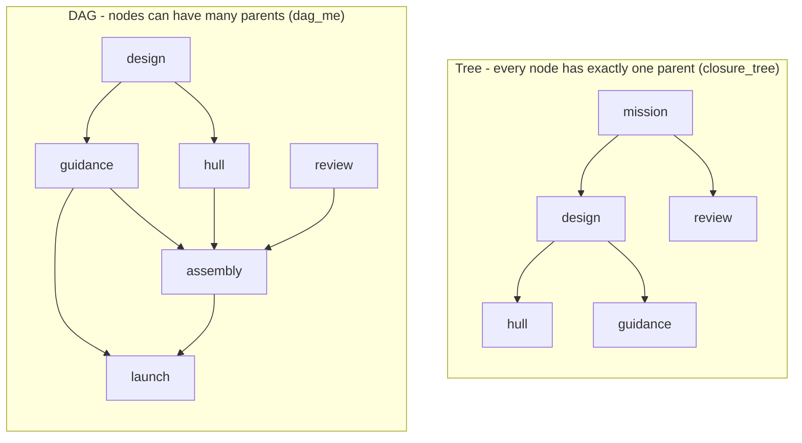
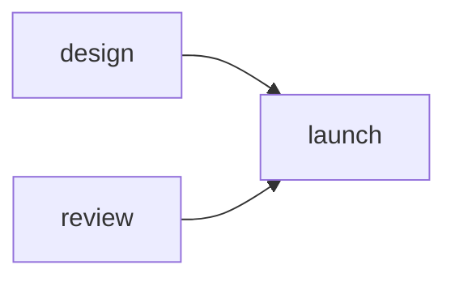
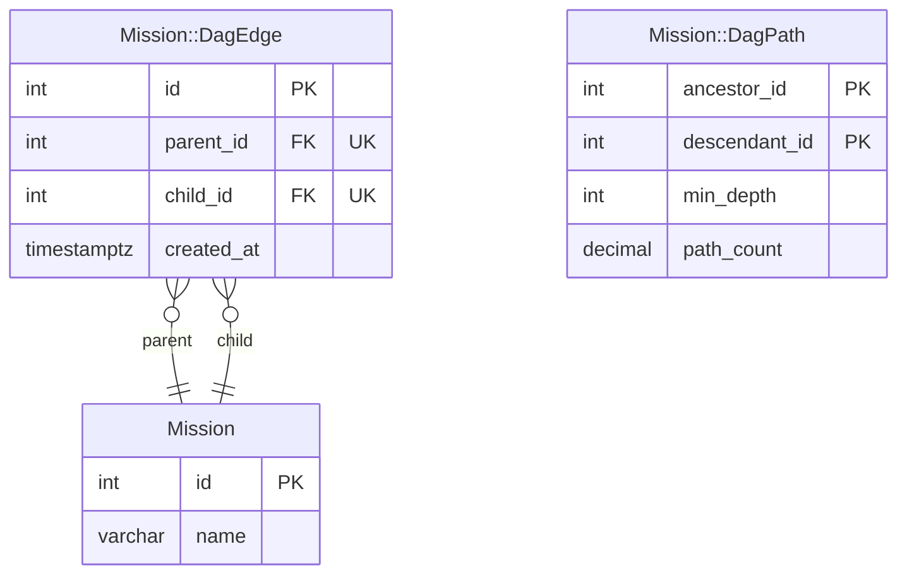
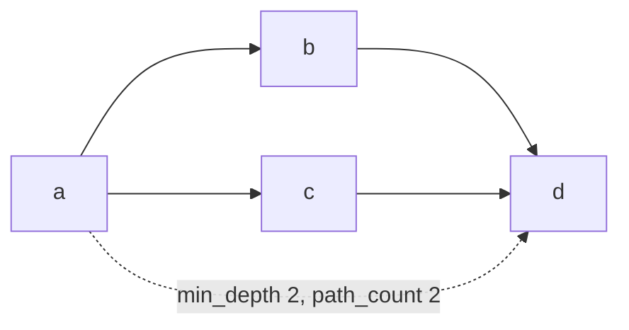

# dag_me

[](https://badge.fury.io/rb/dag_me)
[](https://github.com/seuros/dag_me/actions/workflows/ci.yml)

Multi-parent directed acyclic graphs for ActiveRecord, powered by PostgreSQL 18+.

A companion to [closure_tree](https://github.com/ClosureTree/closure_tree): reach for
closure_tree when your hierarchy is a tree, and for dag_me when it isn't - missions with
multiple dependencies, categories with multiple parents, pipelines, dependency graphs,
org charts that lie.



A tree forbids the interesting part: `assembly` depends on `hull`, `guidance`, **and**
`review`, and two paths converge on `launch`. Those diamonds are exactly what dag_me
maintains - multiple parents, shared descendants, cycle-free, enforced in-database.

```ruby
class Mission < ApplicationRecord
  dag_me
end

design = Mission.create!(name: 'design')
review = Mission.create!(name: 'review')
launch = Mission.create!(name: 'launch')

launch.add_parent(design)
launch.add_parent(review)     # multiple parents: the whole point

launch.parents                # => [design, review]
design.descendants            # => [launch]
launch.ancestors              # => [design, review]
design.ancestor_of?(launch)   # => true

launch.add_child(design)      # => raises DagMe::CycleError, rejected in-database
```



## Installation

```ruby
gem 'dag_me'
```

Generate the migration for each DAG model (tables, triggers, and functions are installed
per model - no dynamic SQL):

```bash
rails generate dag_me:migration Mission
```

Because the schema includes functions and triggers, use `structure.sql`:

```ruby
config.active_record.schema_format = :sql
```

## What gets installed

For a `missions` table:

| Object | Role |
| --- | --- |
| `mission_dag_edges` | Source of truth: `(parent_id, child_id)`, unique, FK cascade |
| `mission_dag_paths` | Transitive closure incl. self-rows: `(ancestor_id, descendant_id, min_depth, path_count)` |
| `mission_dag_edge_insert_check` | `BEFORE INSERT`: advisory lock + cycle rejection |
| `mission_dag_edge_insert_apply` | `AFTER INSERT`: incremental closure expansion |
| `mission_dag_edge_delete_apply` | `AFTER DELETE`: exact `path_count` decrement + `min_depth` repair |
| `mission_dag_node_insert` / `mission_dag_node_delete` | Self-row lifecycle, edge teardown through triggers |
| `mission_dag_rebuild_paths()` / `mission_dag_validate_paths()` | Rebuild from edges / diff against CTE truth |

Generated by [rails_lens](https://github.com/seuros/rails_lens) from the test app
(`make erd`); it reflects the runtime classes dag_me defines, so your own models
get the same diagram for free:



Reads never recurse: `ancestors` and `descendants` are index joins against the closure.

## Maintenance modes

The model API talks to a reachability adapter, not to the storage directly:

```ruby
class Mission < ApplicationRecord
  dag_me                            # maintain: :postgresql_closure (default)
end

class Maneuver < ApplicationRecord
  dag_me maintain: :recursive_cte   # edges only, WITH RECURSIVE at read time
end
```

`:recursive_cte` skips the closure table entirely - good for small graphs, high mutation
rates, and as the truth oracle. Cycle rejection stays in-database either way.

## Multi-tenancy

```ruby
class Satellite < ApplicationRecord
  dag_me scope: :constellation_id    # or scope: [:system_id, :sector]
end
```

Scope columns are stamped onto edge and closure rows by the trigger - always copied from
the node, so raw SQL cannot forge them. Edges connecting nodes in different scopes are
rejected in-database (`DagMe::ScopeError` through the gem API). Advisory locks are hashed
per scope, so tenants don't serialize each other's writes. Changing a node's scope columns
is rejected while the node has edges; isolated nodes restamp their closure self-row.

## One model, many networks

`dag_me` takes an optional name; each named declaration is a fully independent
graph over the same rows, with its own tables, triggers, constants, and adapter:

```ruby
class Relay < ApplicationRecord
  dag_me :power                           # relay_power_dag_edges / _paths
  dag_me :comms, maintain: :recursive_cte # relay_comms_dag_edges only
end

relay.add_child(other, dag: :power)
relay.power_children                      # named associations per network
relay.comms_parents
relay.ancestor_of?(other, dag: :comms)
Relay.roots(dag: :power)
Relay.topologically(:comms)
Relay.dag(:power).rebuild!                # named graph facade
```

Cycles are rejected per network: `a -> b` in `:power` plus `b -> a` in `:comms` is
legal (different graphs); a second `b -> a` in `:power` raises `DagMe::CycleError`.
The bare `dag_me` remains the default graph - the `dag:` keyword and `Model.dag`
with no argument keep meaning it - and a model may mix a default dag with named ones.
`DagMe::DDL.install!(Model)` and the generated migration install every declared
network.

## Topological ordering & subgraphs

```ruby
Mission.topologically                     # whole graph, ancestors first
mission.descendants.topologically         # composes with any relation
Mission.dag.between(a, d)                 # nodes on any path a ~> d, endpoints included
Mission.dag.between(a, d).topologically
mission.subgraph                          # self_and_descendants
mission.subgraph_edges                    # induced edge set (for dot/mermaid exports)
Mission.dag.edges_among(some_relation)    # induced edges of an arbitrary node set
```

Ordering sorts by global ancestor count: for any edge `u -> v`, `ancestors(v)` strictly
contains `ancestors(u) ∪ {u}`, so the count increases along every edge - a valid
topological order for any sub-relation, computed with one index-only subquery per row
in closure mode. Ties break deterministically by primary key.

## API

```ruby
node.parents / node.children              # direct relations (has_many :through)
node.ancestors / node.descendants         # transitive, excludes self
node.self_and_ancestors / node.self_and_descendants
node.add_parent(n) / node.add_child(n)    # raises DagMe::CycleError on cycles
node.remove_parent(n) / node.remove_child(n)
node.ancestor_of?(n) / node.descendant_of?(n)
node.root? / node.leaf?
node.subgraph / node.subgraph_edges
Model.roots / Model.leaves                # relation scopes
Model.topologically

Model.dag                                 # the graph facade (default dag)
Model.dag(:power)                         # a named dag's facade
Model.dag.between(a, d)
Model.dag.edges / Model.dag.edges_among(relation)
Model.dag.rebuild!
Model.dag.validate                        # discrepancy rows ([] = healthy)
Model.dag.valid?
Model.dag.validate!                       # raises DagMe::CorruptionError with the rows
```

Every instance method and `Model.roots` / `Model.leaves` accept `dag:` to target a
named network (`node.add_child(n, dag: :power)`); `Model.topologically` takes the
name positionally so it stays composable as a scope.

uuid primary keys (e.g. `uuidv7()`) work out of the box - graph tables inherit the
node table's primary-key type.

## Composite primary keys

Declare the key **before** the macro; `dag_me` derives one graph column per key
column (`parent_ship_id`, `parent_slot`, `ancestor_ship_id`, ...), and every
join and cycle check compares full tuples:

```ruby
class PowerCell < ApplicationRecord
  self.primary_key = [:ship_id, :slot]
  dag_me
end
```

Single-column keys keep the classic `parent_id` / `child_id` / `ancestor_id` /
`descendant_id` layout. Declaration order matters: `dag_me` reads the declared
key, not the schema (class load stays DB-free).

## The name

**D**irected **A**cyclic **G**raph **M**anagement **E**ngine. Not to be
confused with the Intel Management Engine: this one also runs below your
application with privileges you can't revoke, but it's open source, you asked
for it, and the only ring it operates in is `pg_advisory_xact_lock`.

It's also the macro - a model that wants to be a graph says `dag_me`.

## Errors

The triggers RAISE with custom SQLSTATEs (`DGME1` cycle, `DGME2` cross-scope edge,
`DGME3` scope change while connected, `DGME4` write above READ COMMITTED), so
translation never depends on message text. Through the gem's write API these surface
as `DagMe::CycleError` / `DagMe::ScopeError` / `DagMe::IsolationError`; writes outside
it (raw SQL, `update!` on scope columns) raise the underlying
`ActiveRecord::StatementInvalid` carrying the same SQLSTATE.

## Semantics worth knowing

Solid arrows are edges; the dashed one is what the closure materializes:



- `path_count` is the exact number of distinct paths between two nodes (`numeric`, because
  path counts explode combinatorially in dense DAGs).
- `min_depth` is the shortest-path length. Deleting an edge triggers exact decremental
  maintenance: contributions through the deleted edge are subtracted, zero-count pairs
  are dropped, and `min_depth` is repaired by fixpoint iteration.
- Edge deletion in dense graphs is the expensive operation, by design. Reads are cheap,
  inserts are `ancestors(parent) × descendants(child)`, deletes pay for exactness.
- Concurrent writers are serialized per graph with `pg_advisory_xact_lock` - two
  transactions cannot sneak a cycle in by racing the check.
- Writes require READ COMMITTED: lock-then-recheck needs a fresh snapshot after
  the lock wait, so higher isolation is rejected with `DagMe::IsolationError`.
- Edge inserts take `FOR SHARE` on both node rows; scope changes cannot race
  an in-flight edge into a cross-tenant graph.
- Destroying a node tears down its edges through the triggers (not FK-cascade ordering),
  so the closure shrinks correctly.

## Rake tasks

```bash
rake dag_me:status          # doctor report per network: tables, triggers, functions, closure health
rake dag_me:rebuild         # rebuild every closure (or MODEL=Mission for one)
```

## Testing your app's graphs

The gem ships Minitest assertions for host applications:

```ruby
class GraphSetupTest < ActiveSupport::TestCase
  include DagMe::TestHelper

  test 'missions form a healthy DAG' do
    assert_dag_model Mission, maintain: :postgresql_closure
    assert_dag_model Satellite, scope: :constellation_id
    assert_dag_model Relay, dag: :power, maintain: :postgresql_closure
    assert_dag_valid Mission
    assert_dag_reachable design, launch
    assert_topological_order Mission, Mission.topologically.to_a
  end
end
```

All assertions accept `dag:` for named networks.

## Development

```bash
make up      # postgres:18 via docker compose (port 5438)
make check   # rubocop + full suite
```

The suite includes property tests that apply random edge insertions, edge deletions,
and node destructions (single- and multi-tenant) and validate the closure against
recursive-CTE truth after every single operation, plus concurrency tests racing
reverse edges across threads.

Large graph fixtures are generated, not committed: [vial](https://rubygems.org/gems/vial)
compiles `test/vials/*.vial.rb` into deterministic YAML fixtures at test boot
(`test/fixtures/` is gitignored). The layered 120-node / 300-edge graph exercises
the bulk-import path - Rails fixture loading bypasses triggers, so the pattern is:

```ruby
ActiveRecord::FixtureSet.create_fixtures(...)  # raw edges, no closure maintenance
Mission.dag.rebuild!                           # reconstruct closure from edges
Mission.dag.validate!                          # prove it
```

The same recipe applies to any bulk import (`COPY`, `insert_all`, ETL).

## License

MIT
